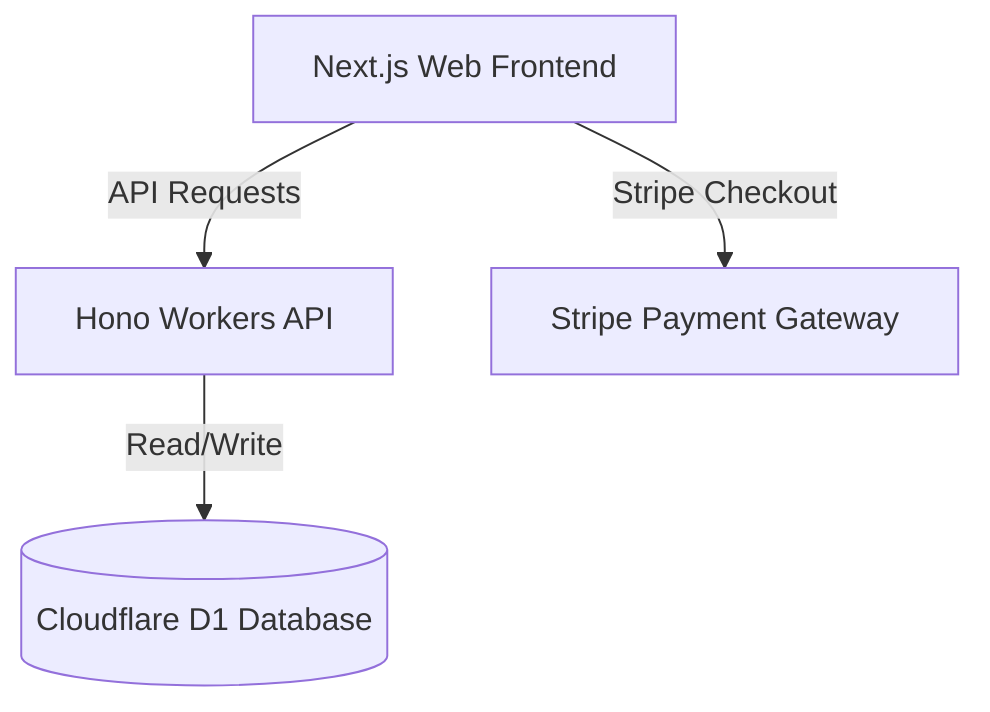

# 🌟 ITS Kashmiere — Enterprise Personal Brand Hub & Monetization Funnel

An ultra-premium, high-fidelity personal brand hub and monetization ecosystem built specifically for **ITS Kashmiere** (Kashmiere Culberson) to consolidate her massive digital presence and establish robust direct-to-audience monetization.

This repository is designed with a **Cloudflare-Maximalist, Zero-Defect** architecture, featuring an interactive and glassmorphic conversion-first frontend alongside a highly performant, stateful, D1-backed backend API.

---

## 🏛️ System Architecture

This repository is structured as a pnpm monorepo:



### Monorepo Layout:
- **`apps/web`**: Next.js 16 (React 19, Tailwind CSS 4, Motion) frontend. Designed with a custom sleek glassmorphic dark theme tailored for brand partnerships and user conversion. Fully optimized and compiled for Cloudflare Pages using `@cloudflare/next-on-pages` with Webpack.
- **`packages/api`**: Hono API framework deployed to Cloudflare Workers, serving structured JSON endpoints and validated using Zod.
- **`packages/api/wrangler.toml`**: Contains direct bindings to Cloudflare D1.

---

## ⚡ Features & Funnels

1. **🔗 Link-in-Bio Consolidation (`/start`)**:
   - Dynamic hub replacing generic link-in-bio services.
   - Houses custom interactive widgets, newsletter signup, and curated social links.

2. **🤝 Brand Partnerships (`/partner`)**:
   - Highly detailed sponsorship tiers, custom pricing grids, and brand inquiry ingestion.
   - Built-in social proof metrics showcasing her platform reach across Instagram, YouTube, and TikTok.

3. **🎤 Keynote Speaking (`/speaking`)**:
   - Custom speaking session scheduler with high-fidelity input forms validating user input via Zod.
   - Live booking pipeline generating high-fidelity mock Stripe checkout tokens.

4. **📖 Self-Confidence Book (`/confidence`)**:
   - Conversion-focused landing page showcasing her self-confidence book with pricing cards and payment flows.

---

## 🗄️ Database & Schema

The application is backed by a production Cloudflare D1 SQLite database instance (`itskashmiere-db`, ID: `a81732ae-e0d5-40a9-9af9-82def462c2c2`).

### Core Tables:

- **`newsletter_subscribers`**:
  - `id` (UUID Primary Key)
  - `email` (Text, Unique)
  - `created_at` (Timestamp)

- **`contact_messages`**:
  - `id` (UUID Primary Key)
  - `name` (Text)
  - `email` (Text)
  - `subject` (Text)
  - `message` (Text)
  - `created_at` (Timestamp)

- **`bookings`**:
  - `id` (UUID Primary Key)
  - `name` (Text)
  - `email` (Text)
  - `event_details` (Text)
  - `status` (Text: pending/confirmed)
  - `stripe_session_id` (Text)
  - `created_at` (Timestamp)

---

## 🛠️ Local Development & Scripts

Ensure you have `pnpm` and `fnm` installed in your macOS/zsh environment.

### 1. Install Dependencies
```bash
pnpm install
```

### 2. Start Dev Servers
```bash
# Start Next.js Frontend (port 3001) and Hono Workers API (port 8787)
pnpm dev
```

---

## 🚀 Deployment

The monorepo is fully optimized to build and deploy to Cloudflare.

### Backend API (Cloudflare Workers)
Deploy the Hono API directly from the root:
```bash
pnpm --filter api run deploy
```
Live Production Endpoint: **[https://itskashmiere-api.rickjefferson.workers.dev](https://itskashmiere-api.rickjefferson.workers.dev)**

### Frontend App (Cloudflare Pages)
Compile and deploy the Next.js App to Pages using Webpack:
```bash
# Compile Pages application via next-on-pages compiler
NODE_ENV=production pnpm --filter web exec next-on-pages

# Deploy compiled output to Cloudflare Pages
pnpm --filter web exec wrangler pages deploy .vercel/output
```
Live Production Site: **[https://itskashmiere.pages.dev](https://itskashmiere.pages.dev)**

---

## 🔒 Enterprise-Security Hardening

- **Zod Input Validation**: Applied strictly on every single API entry point.
- **Security Headers**: High-security CORS routing.
- **Client & Server Input Sanitization**: Prevents SQL injection and cross-site scripting (XSS).
